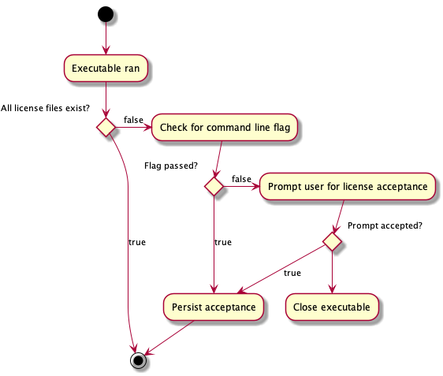
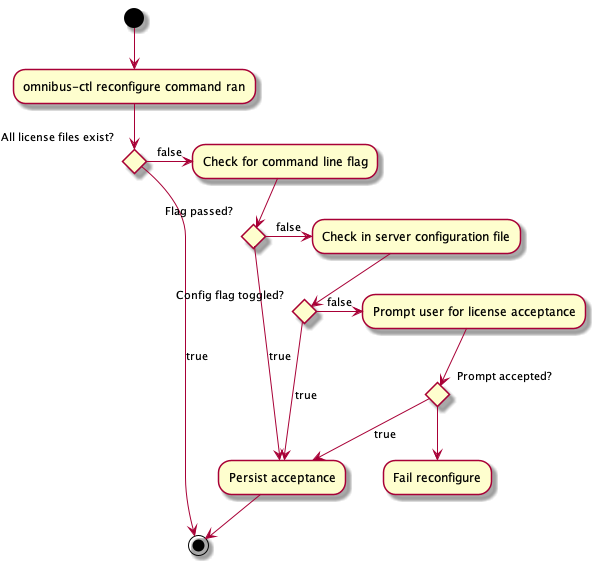

# Chef License Acceptance Flow

> TODO: Table of contents and introduction

# Specification

1. Users of Chef products must have a positive confirmation of the Chef license before using each Chef product.
    * Positive confirmation flow - the idea that, to use any Chef Product, the user must have an interaction with that
      product and make some effort to accept the license. That could take the form of an interactive prompt on the
      command line, a web page in a browser that requires a user to click an 'accept' button, writing a confirmation
      flag into a config file, passing a confirmation flag on the command line or something else.
    * There is no organization-level acceptance, only user-level acceptance.
1. Multiple products can be accepted in a single license acceptance flow.
1. If the license is not accepted the product will exit with code 210
    * This is a randomly chosen number that enables tools like CI to handle license failures with specific behavior.
1. If a tool is ran on a system that has accepted licenses and it installs a product onto a remote system, the set
   of existing license acceptances should be transfered to the remote system. If the remote system needs to accept
   new product licenses it should prompt for that acceptance on the originating system.
    * For example, users install the ChefDK and accept the license for ChefDK, Test Kitchen, InSpec, etc. If the user
      runs `knife bootstrap` against a remote system then the licenses from the originating machine
      should be copied to the bootstrapped machine. This prevents having to accept those licenses on the new machine.
    * Tools only copy across licenses for the products being installed on the remote system. For example, a developer
      has accepted the Chef Client and InSpec licenses on their workstation. When they use `knife bootstrap` to install
      Chef Client on a remote system only the Chef Client license would be copied over, not the InSpec license.
    * If a local tool installs a new product on the remote machine that does not have a local license persisted it
      should prompt the user to accept the new license on the local machine. For example, imagine a user has accepted
      the license for Test Kitchen locally but no other licenses. The user creates a remote machine with Test Kitchen
      and installs Chef Client on the remote machine. Before trying to run Chef Client on the remote machine Test
      Kitchen should take the user through a license acceptance flow locally, persist the accepted Chef Client license
      and transfer it to the remote machine. This license should be persisted and used for all future Chef Client
      runs, locally or remotely. Non acceptance should fail the Test Kitchen converge.
1. The products will persist the license acceptance so users are not required to accept the license on every use.
    * Note: The products will *attempt* to persist this information but some product usage (EG, on ephemeral machines)
      cannot be persisted.
1. New product installs will need to have their license accepted.
    * Example: a user is running A2 and has accepted the A2 license. Then the user installs the Workflow product into
      their existing A2 installation. Before they can use that Workflow product they need to accept the license for it.
    * If the install a new feature that is not considered a new 'product', they would not need to accept a license
      for that.
1. This is a new license that will be released sometime in 2019. Existing Chef users will need to accept this license
   to upgrade to any product released after that time frame. Existing product releases will be bound by existing
   licenses (EG, users can continue to use Chef 14 without accepting the new license).
1. Chef Software will provide tools and guidance on how to accept this license ahead of upgrading products so customers
   can avoid outages and pain that could result from upgrading and being denied usage without understanding why.

## Product List
<!---
https://www.tablesgenerator.com/markdown_tables#
-->
| Client Tools     | Server Tools          | Remote Management Tools        |
|------------------|-----------------------|--------------------------------|
| Chef Client      | Automate 2            | Test Kitchen                   |
| Chef Workstation | Chef Backend          | Knife                          |
| ChefDK           | Chef Server           | Terraform Habitat Provisioner  |
| Habitat binary   | Habitat Build Service |                                |
| InSpec           | Habitat Supervisor    |                                |
| Push Jobs Client | Push Jobs Server      |                                |
|                  | Supermarket           |                                |

In addition the following tools/products embed other products:

* kitchen-inspec -> inspec
* chef-client -> audit-cookbook -> inspec
* A2 -> chef-client -> audit-cookbook -> inspec
* > ...

These top level tools will need to present the license for both the top level tool and all embedded tools for user
acceptance.

## Client Tools

### Ruby Client Tools

Ruby based client-side tools can all be updated to match this specification by incorporating a shared library. This
library will be loaded by command line executables (EG, `chef-client`, `knife`, `inspec`, etc.) and used to enforce a
a common UX for license acceptance.



The above diagram illustrates the UX flow of client side Ruby tools.

For developers to consume this library, add the following lines to your executable's startup:

```ruby
require 'license_acceptance/acceptor'
LicenseAcceptance::Acceptor.check_and_persist!('inspec', Inspec::VERSION)
```

This method performs the license acceptance flow documented below. If the user declines or cannot accept the license
for some reason it prints a simple message to stdout and exits with code 210. If a developer wishes to customize
this behavior they can instead add the following:

```ruby
require 'license_acceptance/acceptor'
begin
  LicenseAcceptance::Acceptor.check_and_persist('inspec', Inspec::VERSION)
rescue LicenseAcceptance::LicenseNotAcceptedError
  # Client specific implementation of how to handle the missing license
  # Could be logging to stdout or a log file then existing, but is up
  # to the client to handle appropriately
  puts "InSpec cannot execute without accepting the license"
  exit 210
end
```

The library also includes a helper to add a command line flag that customers can pass:

```ruby
require "license_acceptance/cli_flags/mixlib_cli"
...
include LicenseAcceptance::CLIFlags::MixlibCLI
```

The standard exit code of 210 is there to allow automated systems to detect a license acceptance failure and deal with
it appropriately. Developers who consume this library can handle the exit logic differently but we recommend exiting 210
to keep a consistent experience among all Chef Software products.

#### License File Persistence

If the user accepts the license a marker file is deposited at `#{ENV[HOME]}/.chef/accepted_licenses/`. These marker
files prevents the user from getting prompted for license acceptance on subsequent runs. Currently we write some
metadata to that file. However, when checking to see if the user has already accepted the license only the presence of
the file matters. It can be completely empty. We hypothesize that the metadata may become useful in the future.

When writing the license marker file different locations are used for different users:

* On *nix systems
    * If the user is root: `/etc/chef/accepted_licenses/`
    * If the user is non-root: `#{ENV[HOME]}/.chef/accepted_licenses/`
* On Windows systems
    * If the user is Administrator: `%HOMEDRIVE%:\chef\accepted_licenses` (typically `C:\chef\accepted_licenses\`)
    * If the user is not Administrator try the following root paths and use the first found (typically `C:\Users\<username>\.chef\accepted_licenses`):
        1. `%HOME%` - typically not defined in Windows.
        1. `%HOMEDRIVE%:%HOMEPATH%` - typically `C:\Users\<username>` but may not exist if defined as an unavailable network mounted drive.
        1. `%HOMESHARE%:%HOMEPATH%` - could refer to a shared drive.
        1. `%USERPROFILE%` - typically `C:\Users\<username>`.

When reading the license file non-`Administrator`/`root` users will look in the `Administrator`/`root` location if it is
not found in their default location. This pattern has the side effect that users could accept licenses as the
`Administrator`/`root` user on a system to ensure the license is present for all users on the system.

### Habitat client tools

The `hab` binary has been updated to match the same license acceptance UX documented here. Because it is written in Rust
it cannot leverage a shared library but has the same functionality and UI. The `hab` binary stores its license file in a
different location than other software in the Chef Software ecosystem:

* On *nix:
    * If the user is root: `/hab/accepted_licenses/`
    * If the user is non-root: `~/.hab/accepted_licenses/`
* On Windows:
    * If the user is Administrator: `C:\hab\accepted_licenses\`
    * If the user is not Administrator: `C:\Users\<username>\.hab\accepted_licenses\`

Similar to the Chef license locations, non-`Administrator`/`root` users will look in the `Administrator`/`root` location
if it is not found in their default location.

The only licenses stored here will be for the Habitat products (`hab`, Habitat Builder, etc.).

Client products (Chef Client, InSpec, etc.) that have a license acceptance flow will _not_ try and expose that flow via
`hab pkg install`. For these tools Habitat operates much like a package manager. The license acceptance flow will be
triggered when the user tries to use the product. This is different from server tools which will be covered below.

## Server Tools

Server tools are different from client tools in that users typically mange them with a process manager. Because of this
there are less opportunities to inject a license acceptance flow. License failures may not be obvious to the user except
by seeing the service fail to start, which is not an ideal UX. We therefore try to have the user accept the license
when they try to *manage* the service.

There is a small chance that users could skirt the license check by not using the management tools (IE, configuring and
starting the services manually) but this is not a supported flow so we are not worried about it.

There are two broad types of server side tools we manage - omnibus packaged tools and hab managed tools.

### Omnibus managed products

All our omnibus managed products use some form of the `omnibus-ctl` command to manage the installation. We will inject
the license acceptance flow into these commands. All the products require some kind of configuration command to run
before the product will start. That should prevent users from running the application in a meaningful way without
encountering the license acceptance flow.

The one difference from the client products is that the server products also contain a user managed service
configuration file where the license can be accepted. The flow therefore is updated to:



See the [License File Persistence](#license-file-persistence) section for information on how the license is persisted.
The omnibus-ctl commands require customers to run as the `root` user so licenses are persisted to the
`/etc/chef/accepted_licenses` directory.

Omnibus managed products can leverage the shared library in the `license-acceptance` gem to facilitate the license
acceptance flow.

### A2

A2 currently has a command line tool to install and configure it, much like Omnibus packaged applications do. This tool
will be updated to follow the same UX we use for those Omnibus tools. The license can be accepted during configuration
and reconfiguration in the case they install a tool later that needs a license accepted.

### Hab managed products

Hab managed products will use a pattern pioneered by A2 called the [MLSA](https://github.com/chef/mlsa) (Master License
Services Agreement). This is a package that, when included as a dependency, will prevent a service from running unless
the user has set a configuration flag saying they accept the license agreement. This pattern requires no changes
to Habitat. Usage would look similar to the following:

```
$ hab svc load chef/chef-server --bind=database:mysql.default
$ echo 'mlsa.accept = true' | hab config apply chef-server.default 1
```

Setting `mlsa.accept = true` on the service accepts the license and allows the service to start. Multiple products could
be set by applying that config to each service group in habitat. Alternatively this config can be set in a `user.toml`
and uploaded with `hab config apply`.

We will make some changes to the existing MLSA package:

1. The MLSA currently spins in a `sleep 5` loop if the license has not been accepted, outputting a log message every
   time. We will change this logic to instead exit and output a message similar to the rest of our UX. It will tell
   users where they can find information about how to accept the license.
1. If the license is accepted the MLSA package will attempt to store the license marker file. If it cannot it logs a
   message and proceeds.
1. We will add more configuration to the package. This includes the ability to customize where license marker files will
   attempt to be persisted, the option to not persist the license acceptance, etc.
1. For services with a service lock the MLSA package will pass down configuration to that service so it can start
   successfully.
     * IE, if `chef/chef-server` has a service lock it cannot start unless service configuration is set showing the
       license has been accepted. The MLSA package would pass the Habitat based license acceptance down into that
       service.
     * > This feature is TBD based on legal's input on whether we need a service lock (see above around omnibus managed
       > services).

These Habitat managed services will therefore not have an interactive prompt based flow like the client tools do. We
feel this is acceptable because server tools are typically managed by a supervisor process instead of a user.

Habitat can run services in an ephimeral environment. In this case it is not possible to persist the license acceptance
information anywhere. One option is to mount a persistent drive to store license marker files across all ephemeral
environments but we do not recommend this. Instead we recommend whatever tools they use to manage deployment accept the
license every time the service is started (EG, `hab license accept chef/chef-server && hab sup run chef/chef-server`).

To accept multiple Habitat licenses at once see the [Bulk License Acceptance Tools](#bulk-license-acceptance-tools)
section.

## Remote Management Tools

Chef Software produces a variety of products that manage remote systems (Test Kitchen, `knife bootstrap`, `chef run`,
etc.). These tools will be updated to copy any local licenses to the remote systems they manage. For example, if a user
has accepted the Chef Client license and uses `knife bootstrap` to bootstrap a remote node, the acceptance will be
copied to that remote node. This prevents `knife bootstrap` from failing to run Chef Client because of a missing
license.

Remote management tools will also allow license acceptance as part of remote management configuration. Let us assume the
user has accepted the license for Test Kitchen but not for Chef Client. If they use Test Kitchen to converge a remote
node then Test Kitchen will take the user through the interactive license accept flow for the Chef Client license. Once
accepted it will be stored locally and copied to the remote machine.

Users will also be able to customize the tool to automatically accept the license instead of prompting. To continue the
Test Kitchen example we will add an optional configuration option. Users could populate their `kitchen.yml` with:

```yaml
provisioner:
  name: chef_zero
  accept_license: true
```

That will automatically accept the Chef Client license locally and send it to all subsequent machines it converges.
Because it will have accepted it locally for the current user it does not need to always be in the configuration.

### Terraform Habitat Provisioner

The [Terraform Habitat Provisioner](https://www.terraform.io/docs/provisioners/habitat.html) covers a wide variety of licenses to potentially be accepted. Users only need to install Terraform but install habitat and any habitat packages on remote systems. Licenses for both habitat and any installed packages need to be accepted locally. This can be done in the following ways:

1. In the Terraform config:
```
resource "aws_instance" "redis" {
  count = 3

  provisioner "habitat" {
    peer = "${aws_instance.redis.0.private_ip}"
    use_sudo = true
    service_type = "systemd"
    accept_license = ["habitat", "core/redis"]

    service {
      name = "core/redis"
      topology = "leader"
      user_toml = "${file("conf/redis.toml")}"
    }
  }
}
```
1. If there are the required licenses present locally they will automatically be copied over to the remote machine.
1. License acceptance can be ready from an environment variable to support CI workflows. EG, `ENV[TERRAFORM_HABITAT_LICENSE_ACCEPT]="habitat,core/redis"`

Accepting the license as part of the Terraform config would attempt to persist the license locally so it would not need
to be accepted in subsequent runs. The license could be seeded locally using the [Bulk License Acceptance
Tools](#bulk-license-acceptance-tools) so they are present before attempting to use the Terraform Habitat Provisioner.

## Upgrade Guidance for Customers

There will be marketing and sales education internally to ensure our staff is ready to help customers through this
transition. To enable this we will produce tools to help customers prepare ahead of time so they experience the least
amount of frustration.

### Bulk License Acceptance Tools

> TODO need to get some time with UX on these

We will produce two tools for users to accept licenses for multiple products in one invocation. There are a few purposes
for this. The first is that it allows users to accept licenses before upgrading to product versions that would ask for a
license. This prevents user frustration through this license change. Secondly it will allow Habitat users to accept
licenses for multiple Habitat packages with a better UX than [`hab config apply`](#hab-managed-products). It can also be
used by external tools (like the [Terraform Habitat Provisioner](#terraform-habitat-provisioner)) to accept licenses.

Invoking both of the following tools will present the user with a similar UX, bridging our experience across our product
lines. It will know about supported Chef Software products and fail if the user tries to accept a license for an unknown
product.

`chef license` will be used for all non-habitat products. Invoking it will take users through the same interactive
prompt based flow that using a client product would. It will also have options to accept via a flag, where to persist
licenses, etc. It can be used to accept licenses for multiple products. Examples:

```
chef license accept chef inspec
chef license accept test-kitchen --prompt yes
chef license accept chef-workstation --persist-location C:\mounted_dir\chef
chef license list # List the licenses that can be accepted
```

`hab license` will be used to accept the license for Habitat products as well as any Habitat packaged Chef products.
This means it can accept the license for the `hab` binary and a package like `chef/chef-server`. Invoking it will also
take users through the same interactive prompt based flow unless they accept the license as part of the invocation. It
can also accept a license for running Habitat services. Examples:

> TODO what configuration will we need to point it to running services?

```
hab license accept # accepts the license for the hab binary only
hab license accept chef/chef-server chef/push-jobs-server
hab license accept chef/chef-server --prompt yes
hab license accept chef/chef-server --prompt yes --persist no
hab license list
hab license list --running # Show running habitat services that have not accepted a license
```

### Chef Client installs

We will produce a cookbook (or modify an existing one) that allows users to accept a license before upgrading to Chef
Client 15. When applied and converged on their fleet it will create the license persistence markers. The upgrade to Chef
Client 15 should then be seamless and not fail due to missing licenses.

### Other Environments

There are bound to be other paths users follow to package, deploy and configure chef products. We will update these
tools to support the new license requirements. Our criteria should be that users can accept the license for product(s)
with the least amount of resistence possible while still ensuring they have gone through a positive license acceptance
flow.

## Windows

> TODO: any special notes about Windows tools. Probably something about where we persist licenses acceptance information.

https://docs.chef.io/dk_windows.html#spaces-and-directories
